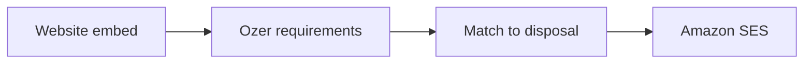

# Circulation

Circulation connects **requirement intake** on your website with **matching disposal emails** to applicants who asked to be kept informed.

## Overview

1. Publish a requirement form embed (tokenised).
2. Submissions create or update requirements and marketing preferences.
3. On a disposal, open **Circulate**, review matches, and send.
4. Applicants unsubscribe via the link in every email.

Compliance background: [Circulation & email compliance](/commercial-property/circulation/compliance).

SES setup checklist for engineers: `apps/web/lib/commercial/circulation/SES_CHECKLIST.md` in the monorepo.

## Set up the website embed

1. Open **Website & portals** or **Requirements** settings (Circulation form).
2. Enable the public form and copy the embed snippet / public URL.
3. Link your privacy notice URL on the form.
4. Submissions arrive as requirements with source `website_embed` and lawful basis `website_requirement_form`.

Public form URL pattern: `/share/requirement-form/[token]`.

## Circulate a disposal

1. Open the disposal → **Interest** or **Management**.
2. Choose **Circulate**.
3. Review suggested matching requirements (score + contact).
4. Deselect anyone who should not receive this send.
5. Confirm — Ozer emails via **Amazon SES**, sets `details_sent` where applicable, and logs the send.

Transactional thank-you emails after form submit still go through ZeptoMail.

## Preferences & suppressions

- Unsubscribe is per **workspace + email** for purpose `matching_disposals`.
- Hard bounces and complaints are suppressed and excluded from future circulations.
- Updating a requirement never re-subscribes an unsubscribed address.

## SES checklist

- `AWS_REGION` / `AWS_ACCESS_KEY_ID` / `AWS_SECRET_ACCESS_KEY` configured for the app
- Sending domain verified in SES
- Production access approved (see [compliance](/commercial-property/circulation/compliance))
- Workspace From address uses that verified domain
