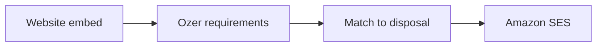

# Circulation

Circulation connects **requirement intake** on your website with **matching disposal emails** to applicants who asked to be kept informed.

## Overview

1. Publish a requirement form embed (tokenised).
2. Submissions create or update requirements and marketing preferences.
3. When a disposal **goes live** (instructed / marketing / under offer), each matching subscribed person gets **one** branded email of **all** properties that currently match them — not only the new listing.
4. Open **Circulation** in the sidebar to see the list, pause auto-send, run a send, and read the log. Per-disposal **Circulate** on Interest / Management is still there for a one-off blast of a single listing.
5. Applicants open a private `/share/matches/[token]` page (workspace brand, not Ozer) to see current matches and manage unsubscribe / “email me when something new matches”.

Compliance background: [Circulation & email compliance](/commercial-property/circulation/compliance).

SES setup checklist for engineers: `apps/web/lib/commercial/circulation/SES_CHECKLIST.md` in the monorepo.

## Circulation workspace

Open **Circulation** in a commercial-property workspace to:

- Turn workspace auto-send on or off
- See who is on the list, last sent, and pause/resume a person
- Trigger a manual run or dry-run
- Read the send log (digest + per-listing Circulate)

## Public matches page

Every circulation email includes unsubscribe plus **Manage preferences**. That tokenised page (`/share/matches/[token]`) uses the workspace logo and colours. Applicants can:

- See live matching disposals (and open the brochure when one is published)
- Toggle “email me when something new matches”
- Unsubscribe / resubscribe

No Ozer login is required.

## Set up the website embed

1. Open **Website & portals** or **Requirements** settings (Circulation form).
2. Enable the public form and copy the embed snippet / public URL.
3. Link your privacy notice URL on the form.
4. Submissions arrive as requirements with source `website_embed` and lawful basis `website_requirement_form`.

Public form URL pattern: `/share/requirement-form/[token]`.

## Automatic digest (new listing → matching people)

- Workspace auto-send is **on by default**. Turn it off on **Circulation**.
- Per-disposal **Include in automatic match emails** is on for new listings and when a listing goes live. Turn it off to exclude that disposal from automatic triggers.
- Each contact receives at most one digest per run. If they were just mailed the **same set** of listings, the send is skipped.
- Daily cron `GET /api/cron/commercial-match-digest` (Bearer `CRON_SECRET`) is the fallback if a publish hook is missed. It also still sends the desk (owner/admin) match digest.

## Circulate a disposal

1. Open the disposal → **Interest** or **Management**.
2. Choose **Circulate**.
3. Review suggested matching requirements (score + contact).
4. Deselect anyone who should not receive this send.
5. Confirm — Amazon SES sends as the workspace (From name / address / reply-to from Brand settings). A dry-run option logs recipients without sending.
6. The send log on Management lists who was mailed, when, and the SES message id.

Transactional thank-you emails after form submit still go through ZeptoMail.

## Preferences & suppressions

- Unsubscribe is per **workspace + email** for purpose `matching_disposals`.
- Hard bounces and complaints are suppressed and excluded from future circulations.
- Updating a requirement never re-subscribes an unsubscribed address.

## SES checklist

- `AWS_REGION` / `AWS_ACCESS_KEY_ID` / `AWS_SECRET_ACCESS_KEY` configured for the app
- Sending domain verified in SES
- Production access approved (see [compliance](/commercial-property/circulation/compliance))
- Workspace From address uses that verified domain (Brand settings contact email is the default)
- `CIRCULATION_UNSUBSCRIBE_SECRET` set in production
